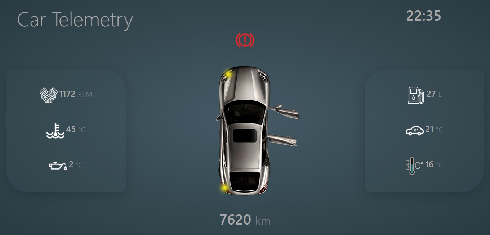

# Car Telemetry
## See in Web data from CAN bus

Write using Blazor - a free and open-source web framework. 
Blazor Server edition of Blazor apps has been used.

## NuGet Packages:

- Microsoft.Extensions.Configuration - to configure COM port in appsettings.json
- System.IO.Ports - to read data from Serial Port

### Algorithm:
- Reading CAN frame from the serial port, to which the CAN frame has already been sent.
- Then composing a CAN frame.
- Then analyzing the frame through the CAN Handlers.
- Display data on the Web.

#### CAN handlers are presented:
- Door Handler, which is responsible for door state(open or closed)
- CurrFuelConsumptionHandler, current fuel consumption
- EngineRPMHandler, engine speed in RPM
- FuelLevelHandler, fuel level in liters
- HandbrakeHandler, state of the handbrake
- InTempHandler, the temperature in the cabin
- OilTempHandler, oil temperature
- OutTempHandler, outside temperature
- TotalKmHandler, odometer
- TurnSignalsHandler, state of the turn signals

#### Input data format:
Ready to process input data in the form:
- 77E 05 62 22 0D 00 65 AA AA

#### Setup:
- Configure appsettings.json with your COM port(normal tested Baud Rate is 115200)

#### Structure of Hardware:

#### Screenshot:

